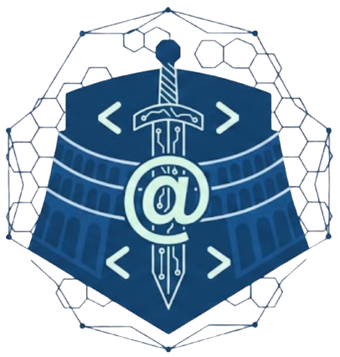

# CodeArena - Programming Competition Platform

<div align="center">
  
  
  <p><strong>A real-time competitive programming platform built with the MERN stack</strong></p>

  
  
  
  
  
</div>

---

## 🚀 Features

### 👥 User Management
- **Role-Based Access**: Students, Teachers, and Admins
- **Authentication**: JWT-based with OAuth (Google & Facebook)
- **Teacher Approval System**: Admin approval required for teacher accounts
- **Profile Management**: Avatar upload, bio, and statistics

### 📚 Practice Problems
- **10 Curated C Problems**: University-level practice exercises
- **Real Code Execution**: Powered by Piston API
- **Multiple Languages**: C, Python, JavaScript, Java, and more
- **Instant Feedback**: Test cases with detailed results

### 🏆 Competitive Programming
- **Real-Time Competitions**: Live coding battles
- **Lobby System**: Create and join competition rooms
- **Live Leaderboard**: Real-time scoring with WebSocket updates
- **Timer System**: Countdown with automatic submission cutoff

### 🎨 Modern UI/UX
- **DaisyUI Components**: Beautiful, accessible UI
- **Custom "CodeArena" Theme**: Branded color scheme
- **Monaco Editor**: VS Code-quality code editing
- **Responsive Design**: Works on desktop, tablet, and mobile
- **Dark Theme**: Eye-friendly coding environment

### 🔒 Admin Panel
- **User Management**: Approve/reject teachers
- **Role Assignment**: Promote users to different roles
- **Problem Management**: CRUD operations for problems
- **Competition Oversight**: Monitor active competitions

---

## 🛠️ Tech Stack

### Frontend
- **React 19** with React Router v7
- **Vite** - Lightning-fast build tool
- **DaisyUI** + **Tailwind CSS** - UI framework
- **Monaco Editor** - Code editor
- **Socket.IO Client** - Real-time communication
- **Axios** - HTTP client
- **React Hot Toast** - Notifications

### Backend
- **Node.js** + **Express** - Server framework
- **MongoDB** + **Mongoose** - Database
- **Socket.IO** - WebSocket server
- **JWT** - Authentication
- **Passport.js** - OAuth integration
- **Bcrypt** - Password hashing
- **Piston API** - Code execution

---

## 📋 Prerequisites

- **Node.js** v18+ ([Download](https://nodejs.org/))
- **MongoDB Atlas** account ([Sign up](https://www.mongodb.com/cloud/atlas))
- **Git** ([Download](https://git-scm.com/))

---

## 🔧 Installation

### 1. Clone the Repository

```bash
git clone https://github.com/yourusername/CodeArena.git
cd CodeArena
```

### 2. Backend Setup

```bash
cd backend
npm install
```

Create `.env` file in `backend/` directory:

```env
PORT=5000
NODE_ENV=development
MONGODB_URI=your-mongodb-connection-string
JWT_SECRET=your-secret-key
JWT_EXPIRE=7d
FRONTEND_URL=http://localhost:5173

# Optional: OAuth Configuration
GOOGLE_CLIENT_ID=your-google-client-id
GOOGLE_CLIENT_SECRET=your-google-client-secret
GOOGLE_CALLBACK_URL=http://localhost:5000/api/auth/google/callback

FACEBOOK_APP_ID=your-facebook-app-id
FACEBOOK_APP_SECRET=your-facebook-app-secret
FACEBOOK_CALLBACK_URL=http://localhost:5000/api/auth/facebook/callback
```

Start backend server:

```bash
npm run dev
```

Backend runs on `http://localhost:5000`

### 3. Frontend Setup

```bash
cd ../frontend
npm install
```

Create `.env.local` file in `frontend/` directory:

```env
VITE_API_URL=http://localhost:5000/api
```

Start frontend dev server:

```bash
npm run dev
```

Frontend runs on `http://localhost:5173`

---

## 🎯 Usage

### First Time Setup

1. **Create Admin Account**:
   - Register at `http://localhost:5173/register`
   - Use MongoDB Compass or mongosh to manually set `role: 'admin'` for your user

2. **Seed Practice Problems** (Optional):
   - The database already includes 10 C practice problems
   - Check `backend/models/SampleProblem.js` for examples

3. **Login**:
   - Visit `http://localhost:5173/login`
   - Use your credentials or OAuth

### As a Student

1. **Practice Problems**:
   - Navigate to "Practice" in the dashboard
   - Select a problem and start coding
   - Submit code and view results

2. **Competitions**:
   - Browse available competition lobbies
   - Join a lobby to participate
   - Compete in real-time with other students

### As a Teacher

1. **Create Problems**:
   - Go to "Problems" in teacher dashboard
   - Add new practice or competition problems
   - Configure test cases

2. **Create Competitions**:
   - Navigate to "Competitions"
   - Create new competition lobbies
   - Set difficulty and time limits

### As an Admin

1. **Approve Teachers**:
   - Go to Admin Panel → Pending Teachers
   - Review and approve/reject requests

2. **Manage Users**:
   - View all users
   - Change user roles
   - Monitor system usage

---

## 🚀 Deployment

See [DEPLOYMENT.md](DEPLOYMENT.md) for detailed instructions on deploying to Render.com.

### Quick Deploy to Render

1. Push code to GitHub
2. Connect repository to Render
3. Render will detect `render.yaml` and auto-deploy both services
4. Configure environment variables
5. Done! 🎉

**Estimated Deploy Time**: 5-10 minutes  
**Cost**: Free (with limitations) or $7/month for production

---

## 📁 Project Structure

```
CodeArena/
├── backend/
│   ├── config/          # Database, passport config
│   ├── middleware/      # Auth, error handling
│   ├── models/          # Mongoose schemas
│   ├── routes/          # API routes
│   ├── services/        # Piston API integration
│   ├── .env             # Environment variables
│   └── server.js        # Express server
├── frontend/
│   ├── public/          # Static assets
│   ├── src/
│   │   ├── api/         # API client functions
│   │   ├── components/  # React components
│   │   ├── context/     # React context (auth)
│   │   ├── layouts/     # Layout components
│   │   ├── pages/       # Page components
│   │   ├── App.jsx      # Main app component
│   │   └── main.jsx     # Entry point
│   ├── .env.local       # Local env variables
│   └── vite.config.js   # Vite configuration
├── render.yaml          # Render deployment config
└── DEPLOYMENT.md        # Deployment guide
```

---

## 🧪 Testing

### Manual Testing

1. **Registration/Login**: Create accounts with different roles
2. **Practice Problems**: Submit code and verify execution
3. **Competitions**: Create lobby, join with multiple users
4. **Real-time**: Test WebSocket connections for live updates
5. **OAuth**: Test Google/Facebook login flows

### API Health Check

```bash
curl http://localhost:5000/api/health
```

Response: `{"status":"ok","message":"CodeArena API is running"}`

---

## 🤝 Contributing

Contributions are welcome! Please follow these steps:

1. Fork the repository
2. Create a feature branch (`git checkout -b feature/AmazingFeature`)
3. Commit changes (`git commit -m 'Add AmazingFeature'`)
4. Push to branch (`git push origin feature/AmazingFeature`)
5. Open a Pull Request

---

## 📝 License

This project is licensed under the MIT License.

---

## 👨‍💻 Developer

**Developed by Em411010**

[](https://github.com/Em411010)

---

## 🙏 Acknowledgments

- **Piston API** - Code execution engine
- **DaisyUI** - UI component library
- **Monaco Editor** - Code editor
- **Socket.IO** - Real-time communication
- **MongoDB Atlas** - Cloud database

---

## 📧 Support

For issues, questions, or suggestions:
- Open an issue on GitHub
- Contact: [your-email@example.com]

---

<div align="center">
  Made with ❤️ by Em411010
</div>
